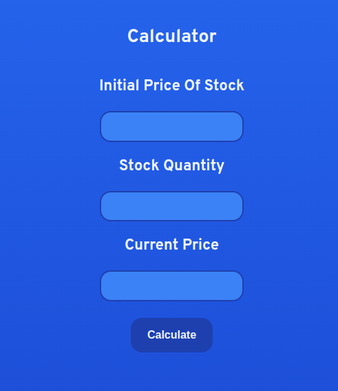
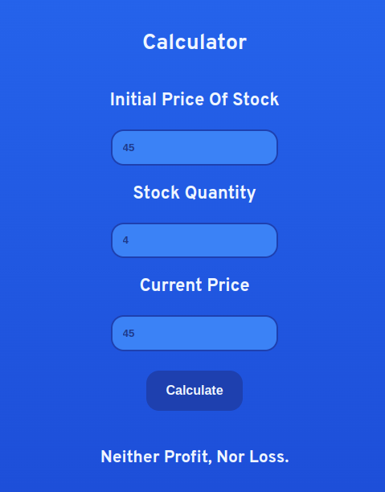

# STOCK PROFIT OR LOSS CALCULATOR

## Made Using HTML, CSS and JavaScript

Do you own any stocks? Do you want a simple and quick way to calculate your profits or loss? This web-app can definitely do the job for you!

Thw Stock Profit Or Loss Calculator has three input fields. **Initial Price Of Stock**, **Stock Quantity** and **Current Price** of the stock. After filling each field individually, you need to click on the **calculate** button to calculate your profit / loss.

The calculator calculates the amount of profit or loss in numerical value and its percentage as well.

- **Calculator's Interface**

The final output will get displayed below the calculate button. Any errors will get displayed there as well.

- **Calculator's Working**

***
#### Happy Calclulating !
